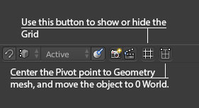

# Icon Header
This addon add many operator into your 3D View Header.

* Grid : Hide or Show the grid
* Center Pivot and Mesh : Change the pivot point from your selected object and move to 0 World.
* Smooth Shading : This operator automated shading function, make a smooth shading to selected object, activate auto smooth function an change angle to 45 degree

# How to used
